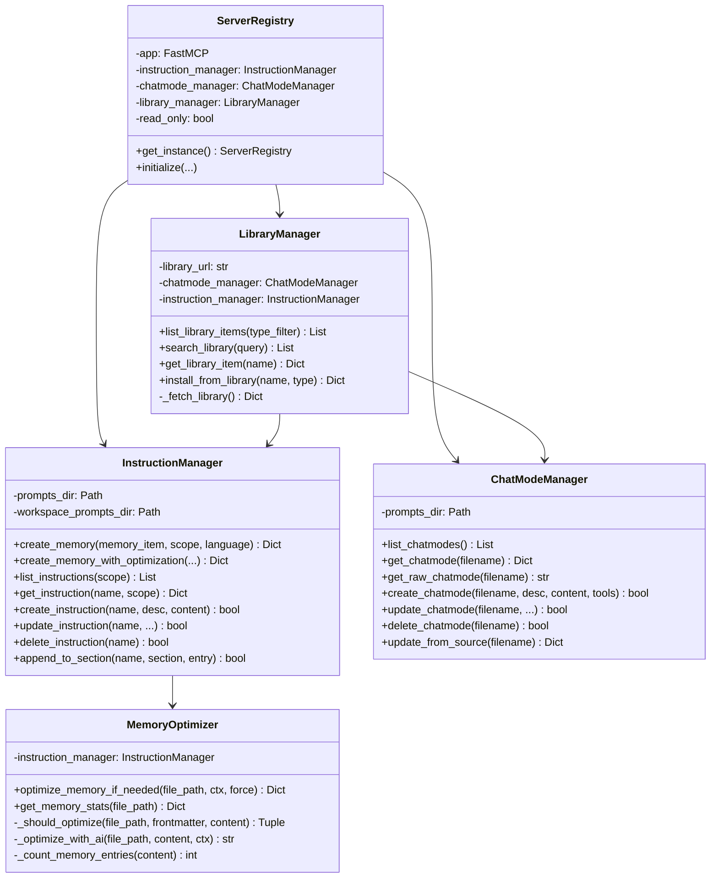
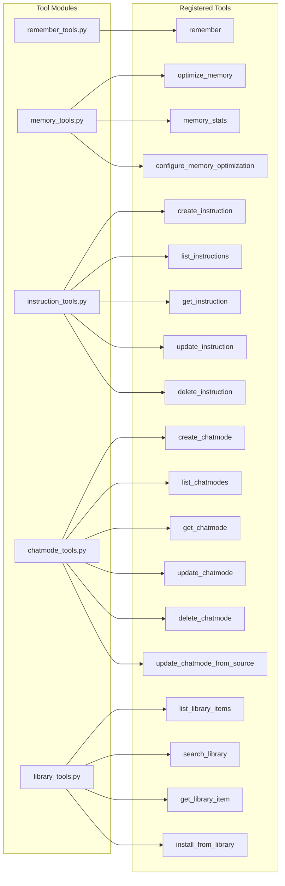

# Mode Manager MCP - Architecture Documentation

This document provides detailed architecture diagrams and technical documentation for the Mode Manager MCP server.

## Table of Contents
- [System Overview](#system-overview)
- [Component Architecture](#component-architecture)
- [Data Flow Diagrams](#data-flow-diagrams)
- [File System Organization](#file-system-organization)
- [Tool Interaction Patterns](#tool-interaction-patterns)

## System Overview

Mode Manager MCP is an MCP (Model Context Protocol) server that manages GitHub Copilot customization files in VS Code. It implements a multi-manager architecture where specialized managers handle different types of files and operations.

### High-Level Architecture

```
┌─────────────────────────────────────────────────────────────────┐
│                    VS Code GitHub Copilot                        │
│  (Reads .instructions.md and .chatmode.md files automatically)  │
└────────────────────────────┬────────────────────────────────────┘
                             │ MCP Protocol (stdio)
                             │
┌────────────────────────────▼────────────────────────────────────┐
│                   Mode Manager MCP Server                        │
│  ┌────────────────────────────────────────────────────────────┐ │
│  │              FastMCP Application Core                      │ │
│  │  • Request routing                                         │ │
│  │  • Tool registration and execution                         │ │
│  │  • Middleware pipeline (logging, timing, rate limiting)    │ │
│  └────────────────────────────────────────────────────────────┘ │
│                                                                  │
│  ┌─────────────────────────────────────────────────────────┐   │
│  │ Instruction Manager │ Chatmode Manager │ Library Manager│   │
│  │  • Memory ops       │ • CRUD ops       │ • Fetch library│   │
│  │  • User/workspace   │ • Source updates │ • Install items│   │
│  │  • Language scope   │ • Frontmatter    │ • Search       │   │
│  └─────────────────────────────────────────────────────────┘   │
│                                                                  │
│  ┌─────────────────────────────────────────────────────────┐   │
│  │            Memory Optimizer                              │   │
│  │  • AI-powered consolidation                              │   │
│  │  • Criteria checking (size/entries/time)                 │   │
│  │  • Backup management                                     │   │
│  └─────────────────────────────────────────────────────────┘   │
│                                                                  │
│  ┌─────────────────────────────────────────────────────────┐   │
│  │            File Operations Layer                         │   │
│  │  • YAML frontmatter parsing/writing                      │   │
│  │  • Backup creation (.backup suffix)                      │   │
│  │  • Safe file operations                                  │   │
│  └─────────────────────────────────────────────────────────┘   │
└───────────────────────────┬──────────────────────────────────────┘
                            │
              ┌─────────────┴──────────────┐
              │                            │
              ▼                            ▼
┌──────────────────────────┐  ┌──────────────────────────┐
│ User Prompts Directory   │  │ Workspace Instructions   │
│ ~/.vscode/prompts/       │  │ .github/instructions/    │
│                          │  │                          │
│ • memory.instructions.md │  │ • memory.instructions.md │
│ • memory-*.instructions  │  │ • memory-*.instructions  │
│ • *.chatmode.md          │  │ • *.instructions.md      │
└──────────────────────────┘  └──────────────────────────┘
```

## Component Architecture

### Core Managers



### Tool Registration



## Data Flow Diagrams

### Memory Creation Flow

```
User: "Remember that I prefer snake_case"
    │
    ▼
┌────────────────────────────────────────┐
│ 1. Copilot calls: remember(            │
│    memory_item="I prefer snake_case",  │
│    scope="user"                        │
│ )                                      │
└────────────────┬───────────────────────┘
                 │
                 ▼
┌────────────────────────────────────────┐
│ 2. FastMCP Server                      │
│    • Route to remember_tools           │
│    • Apply middleware                  │
│    • Check read-only mode              │
└────────────────┬───────────────────────┘
                 │
                 ▼
┌────────────────────────────────────────┐
│ 3. Scope Detection                     │
│    • Parse memory_item text            │
│    • Check for workspace keywords      │
│    • "I prefer" → user scope           │
│    • Validate scope enum               │
└────────────────┬───────────────────────┘
                 │
                 ▼
┌────────────────────────────────────────┐
│ 4. Get Workspace Context (if needed)   │
│    • Call ctx.list_roots()             │
│    • Parse workspace URI               │
│    • Build .github/instructions path   │
└────────────────┬───────────────────────┘
                 │
                 ▼
┌────────────────────────────────────────┐
│ 5. InstructionManager.create_memory    │
│    • Get prompts directory             │
│    • Build memory file path            │
│    • Check if file exists              │
└────────────────┬───────────────────────┘
                 │
        ┌────────┴────────┐
        │                 │
        ▼                 ▼
    File Exists?      File Missing
        │                 │
        │                 ▼
        │     ┌───────────────────────────┐
        │     │ 6a. Create Memory File    │
        │     │    • Generate frontmatter │
        │     │      - applyTo: '**'      │
        │     │      - description        │
        │     │    • Write initial content│
        │     │    • Add ## Memories      │
        │     └───────────┬───────────────┘
        │                 │
        └─────────────────┘
                 │
                 ▼
┌────────────────────────────────────────┐
│ 6b. Append Memory Entry                │
│    • Generate timestamp                │
│    • Format: "- **YYYY-MM-DD HH:MM:**  │
│      {memory_item}"                    │
│    • Append to file                    │
└────────────────┬───────────────────────┘
                 │
                 ▼
┌────────────────────────────────────────┐
│ 7. MemoryOptimizer.optimize_if_needed  │
│    • Check file size                   │
│    • Check entry count                 │
│    • Check last optimization time      │
│    • Apply optimization if needed      │
└────────────────┬───────────────────────┘
                 │
        ┌────────┴────────┐
        │                 │
        ▼                 ▼
   Optimized         Not Optimized
        │                 │
        └─────────────────┘
                 │
                 ▼
┌────────────────────────────────────────┐
│ 8. Return Success Response             │
│    • File path                         │
│    • Scope (user/workspace)            │
│    • Language (if applicable)          │
│    • Optimization status               │
└────────────────┬───────────────────────┘
                 │
                 ▼
        Copilot displays result
```

### Memory Optimization Flow

```
Trigger: append_to_section() called
    │
    ▼
┌────────────────────────────────────────┐
│ 1. MemoryOptimizer.optimize_if_needed  │
│    • Read file frontmatter             │
│    • Read file content                 │
└────────────────┬───────────────────────┘
                 │
                 ▼
┌────────────────────────────────────────┐
│ 2. Check Optimization Criteria         │
│    • File size > sizeThreshold?        │
│    • Entries since last > threshold?   │
│    • Days since last > threshold?      │
│    • autoOptimize enabled?             │
└────────────────┬───────────────────────┘
                 │
        ┌────────┴────────┐
        │                 │
        ▼                 ▼
    Criteria Met      Criteria Not Met
        │                 │
        │                 ▼
        │         Return {status: "skipped"}
        │
        ▼
┌────────────────────────────────────────┐
│ 3. Check AI Sampling Available         │
│    • Check ctx.sample() capability     │
└────────────────┬───────────────────────┘
                 │
        ┌────────┴────────┐
        │                 │
        ▼                 ▼
    Available         Not Available
        │                 │
        │                 ▼
        │         Update metadata only
        │         Return {status: "metadata_updated"}
        │
        ▼
┌────────────────────────────────────────┐
│ 4. Create Backup                       │
│    • Copy to .backup file              │
│    • Preserve original                 │
└────────────────┬───────────────────────┘
                 │
                 ▼
┌────────────────────────────────────────┐
│ 5. AI Sampling                         │
│    • Build optimization prompt         │
│    • Call ctx.sample() with content    │
│    • Receive optimized content         │
└────────────────┬───────────────────────┘
                 │
                 ▼
┌────────────────────────────────────────┐
│ 6. Parse AI Response                   │
│    • Extract YAML frontmatter          │
│    • Extract markdown content          │
│    • Validate structure                │
└────────────────┬───────────────────────┘
                 │
                 ▼
┌────────────────────────────────────────┐
│ 7. Merge Frontmatter                   │
│    • Preserve user settings            │
│    • Update lastOptimized              │
│    • Update entryCount                 │
│    • Increment optimizationVersion     │
└────────────────┬───────────────────────┘
                 │
                 ▼
┌────────────────────────────────────────┐
│ 8. Write Optimized File                │
│    • Write YAML frontmatter            │
│    • Write markdown content            │
└────────────────┬───────────────────────┘
                 │
                 ▼
┌────────────────────────────────────────┐
│ 9. Return Success Response             │
│    • status: "optimized"               │
│    • entries_before, entries_after     │
│    • backup_created: true              │
└────────────────────────────────────────┘
```

### Library Installation Flow

```
User: "Install Beast Mode from the library"
    │
    ▼
┌────────────────────────────────────────┐
│ 1. Copilot calls:                      │
│    install_from_library(               │
│        name="Beast Mode",              │
│        type="chatmode"                 │
│    )                                   │
└────────────────┬───────────────────────┘
                 │
                 ▼
┌────────────────────────────────────────┐
│ 2. LibraryManager._fetch_library()     │
│    • HTTP GET to library URL           │
│    • Parse JSON response               │
│    • Cache library data                │
└────────────────┬───────────────────────┘
                 │
                 ▼
┌────────────────────────────────────────┐
│ 3. Search Library                      │
│    • Iterate chatmodes/instructions    │
│    • Match by name (case-insensitive)  │
│    • Get item details                  │
└────────────────┬───────────────────────┘
                 │
        ┌────────┴────────┐
        │                 │
        ▼                 ▼
    Item Found       Item Not Found
        │                 │
        │                 ▼
        │         Return error
        │
        ▼
┌────────────────────────────────────────┐
│ 4. Fetch Item Content                  │
│    • HTTP GET to source_url            │
│    • Handle encoding (utf-8, etc.)     │
│    • Parse content                     │
└────────────────┬───────────────────────┘
                 │
                 ▼
┌────────────────────────────────────────┐
│ 5. Parse Frontmatter                   │
│    • Write to temp file                │
│    • Parse YAML frontmatter            │
│    • Extract markdown body             │
└────────────────┬───────────────────────┘
                 │
                 ▼
┌────────────────────────────────────────┐
│ 6. Prepare for Installation            │
│    • Ensure source_url in frontmatter  │
│    • Generate filename                 │
│    • Check if file exists              │
└────────────────┬───────────────────────┘
                 │
        ┌────────┴────────┐
        │                 │
        ▼                 ▼
    File Exists      File Missing
        │                 │
        │                 ▼
        │         ┌───────────────────────┐
        │         │ Create new file        │
        │         └───────────┬───────────┘
        │                     │
        │         ┌───────────▼───────────┐
        │         │ Ask user permission    │
        │         │ (overwrite?)           │
        │         └───────────┬───────────┘
        │                     │
        └─────────────────────┘
                 │
                 ▼
┌────────────────────────────────────────┐
│ 7. Install File                        │
│    • ChatModeManager.create_chatmode() │
│      OR                                │
│    • InstructionManager.create_instr() │
│    • Write frontmatter + content       │
└────────────────┬───────────────────────┘
                 │
                 ▼
┌────────────────────────────────────────┐
│ 8. Return Success Response             │
│    • Installed filename                │
│    • File path                         │
│    • Source URL                        │
└────────────────────────────────────────┘
```

## File System Organization

### Directory Structure

```
User Files:
~/.vscode/prompts/
├── memory.instructions.md              # General personal memory
├── memory-python.instructions.md       # Python-specific memory
├── memory-javascript.instructions.md   # JavaScript-specific memory
├── memory-go.instructions.md          # Go-specific memory
├── custom.instructions.md             # Custom instructions
├── beast-mode.chatmode.md             # Chatmode: Beast Mode
├── architect-mode.chatmode.md         # Chatmode: Architect Mode
└── debug-mode.chatmode.md             # Chatmode: Debug Mode

Workspace Files:
<workspace>/.github/instructions/
├── memory.instructions.md              # Team memory
├── memory-python.instructions.md       # Team Python conventions
├── onboarding.instructions.md         # Team onboarding
└── style-guide.instructions.md        # Team style guide

Backup Files:
<any-directory>/
├── memory.instructions.md.backup       # Automatic backup
└── memory.instructions.md.backup.1     # Older backup
```

### File Format Specification

#### Instruction File (`.instructions.md`)

```markdown
---
applyTo: '**/*.py'                      # File pattern (YAML string)
description: Python coding preferences   # Human-readable description
lastOptimized: '2025-12-08T23:00:00Z'   # ISO 8601 timestamp
entryCount: 15                          # Number of memory entries
autoOptimize: true                      # Enable auto-optimization
sizeThreshold: 50000                    # Bytes before optimization
entryThreshold: 20                      # New entries before optimization
timeThreshold: 7                        # Days before optimization
optimizationVersion: 4                  # Optimization format version
---

# Memory Title

Markdown content with memory entries, organized by sections.

## Memories
- **2025-12-08 23:00:** First memory entry
- **2025-12-08 23:05:** Second memory entry
```

#### Chatmode File (`.chatmode.md`)

```markdown
---
description: Beast Mode for deep coding   # Human-readable description
tools:                                    # Optional tool list
  - python
  - bash
  - browser
source_url: https://gist.github.../...   # Optional source URL
---

# Chatmode Instructions

You are in Beast Mode. You are an expert programmer with deep knowledge
of software architecture, design patterns, and best practices.

## Behavior
- Think deeply before responding
- Consider edge cases
- Provide detailed explanations
- Write production-quality code

## Tools
You have access to: python, bash, browser
```

## Tool Interaction Patterns

### Pattern 1: Simple Memory Storage

```python
# Minimal interaction
remember(memory_item="I prefer detailed docstrings")

# Flow:
# 1. Auto-detect scope (user) from "I prefer"
# 2. Use default memory.instructions.md
# 3. Append with timestamp
# 4. Check optimization criteria
# 5. Return confirmation
```

### Pattern 2: Scoped Memory Storage

```python
# Explicit workspace scope
remember(
    memory_item="This project uses PostgreSQL v14",
    scope="workspace"
)

# Flow:
# 1. Get workspace root from context
# 2. Target .github/instructions/memory.instructions.md
# 3. Append with timestamp
# 4. Check optimization criteria
# 5. Return confirmation with workspace path
```

### Pattern 3: Language-Specific Memory

```python
# Language-specific memory
remember(
    memory_item="Always use type hints",
    language="python"
)

# Flow:
# 1. Target memory-python.instructions.md
# 2. Set applyTo: '**/*.py' in frontmatter
# 3. Append with timestamp
# 4. Check optimization criteria
# 5. Return confirmation with language info
```

### Pattern 4: Library Installation

```python
# Install from library
install_from_library(
    name="Beast Mode",
    type="chatmode"
)

# Flow:
# 1. Fetch library JSON from URL
# 2. Search for "Beast Mode" chatmode
# 3. Download content from source_url
# 4. Parse frontmatter and content
# 5. Create beast-mode.chatmode.md
# 6. Return installation details
```

### Pattern 5: Memory Optimization

```python
# Manual optimization
optimize_memory(force=True)

# Flow:
# 1. Get default user memory file
# 2. Skip criteria check (force=True)
# 3. Create backup
# 4. Call AI sampling with consolidation prompt
# 5. Parse AI response
# 6. Merge frontmatter with optimization metadata
# 7. Write optimized file
# 8. Return statistics
```

## Security & Safety

### Backup Strategy
- All update/delete operations create `.backup` files
- Backups preserve original content for recovery
- Multiple backups numbered sequentially (`.backup.1`, `.backup.2`, etc.)

### Read-Only Mode
- Prevents all write operations
- Useful for testing or restricted environments
- All tools return error in read-only mode

### Validation
- Scope validation (user/workspace enum)
- Path validation (no directory traversal)
- Encoding detection (utf-8, cp1252, latin1)
- YAML frontmatter validation

## Performance Considerations

### Optimization Triggers
Memory optimization is expensive (AI sampling), so triggers are carefully balanced:
- **Size threshold**: 50KB (about 50-100 memory entries)
- **Entry threshold**: 20 new entries since last optimization
- **Time threshold**: 7 days since last optimization

### File Operations
- Append-only for memory entries (fast)
- Full rewrite only during optimization
- Backup creation is atomic (copy then rename)

### Library Caching
- Library JSON fetched on first access
- Cached in memory for subsequent requests
- Timeout: 30 seconds for HTTP requests

## Extension Points

### Custom Library
Set a custom library URL:
```bash
export MCP_LIBRARY_URL=https://example.com/my-library.json
```

Library JSON format:
```json
{
  "name": "My Custom Library",
  "version": "1.0.0",
  "chatmodes": [
    {
      "name": "Custom Mode",
      "description": "My custom chatmode",
      "source_url": "https://example.com/custom-mode.md",
      "tags": ["custom", "mode"]
    }
  ],
  "instructions": [...]
}
```

### Custom Prompts Directory
Override the default prompts directory:
```python
server = ModeManagerServer(prompts_dir="/custom/path")
```

### Middleware Extensions
Add custom middleware to the FastMCP pipeline:
```python
from fastmcp.server.middleware import Middleware

class CustomMiddleware(Middleware):
    async def __call__(self, request, handler):
        # Custom logic
        return await handler(request)

server.app.add_middleware(CustomMiddleware())
```

## Testing

The project includes comprehensive tests:

- **Unit tests**: Individual manager functions
- **Integration tests**: Full server initialization
- **Functional tests**: Tool execution end-to-end
- **Memory isolation tests**: Scoping behavior

Run tests:
```bash
uv sync --group dev
uv run pytest
```

## Logging

Logs are written to:
- **stderr**: All log messages
- **File**: `/tmp/mode_manager_logs/mode_manager.log` (if writable)

Enable debug logging:
```bash
mode-manager-mcp --debug
```

Log format:
```
2025-12-08 23:00:00,000 - mode_manager_mcp.server - INFO - Server initialized
```
