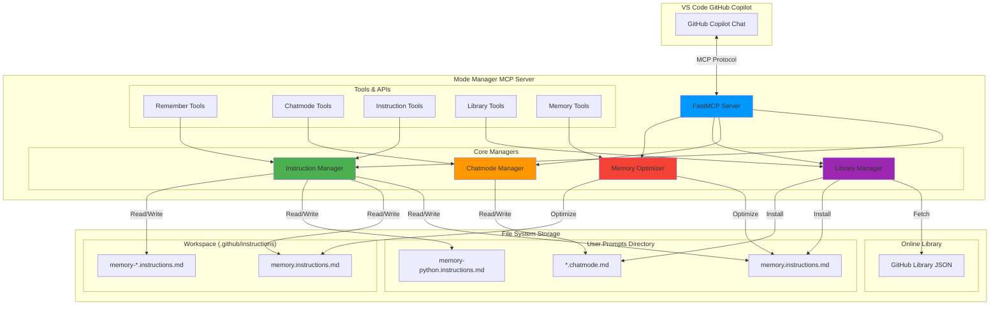

<picture>
  <source media="(prefers-color-scheme: dark)" srcset="remember-new-logo-complete-white.svg">
  <source media="(prefers-color-scheme: light)" srcset="remember-new-logo-complete-black.svg">
  
</picture>


# Mode Manager MCP - Complete Copilot Customization & Memory System

[](https://insiders.vscode.dev/redirect/mcp/install?name=modemanager&config=%7B%22command%22%3A%22pipx%22%2C%22args%22%3A%5B%22run%22%2C%22mode-manager-mcp%22%5D%7D)
[](https://insiders.vscode.dev/redirect/mcp/install?name=modemanager&config=%7B%22command%22%3A%22pipx%22%2C%22args%22%3A%5B%22run%22%2C%22mode-manager-mcp%22%5D%7D&quality=insiders)
&nbsp;&nbsp;&nbsp;&nbsp;[](https://opensource.org/licenses/MIT)
[](https://www.python.org/downloads/)

**Mode Manager MCP** is a comprehensive MCP (Model Context Protocol) server that provides complete management of GitHub Copilot customization files in VS Code. It combines persistent AI memory, chatmode management, instruction files, and a curated library system—all accessible through natural language or dedicated tools.

## What Does This Tool Actually Do?

Mode Manager MCP gives you full control over your Copilot experience by managing three types of customization files:

1. **`.instructions.md` files** - Define custom instructions, memory, and context for Copilot
2. **`.chatmode.md` files** - Create specialized modes for different tasks (e.g., "Beast Mode", "Architect Mode")
3. **Library access** - Browse and install curated prompts and chatmodes from the community

### Core Capabilities

- 🧠 **Persistent Memory System** - Store personal, workspace, and language-specific memories
- 🎯 **Chatmode Management** - Create, update, and switch between specialized Copilot modes
- 📝 **Instruction Files** - Manage custom instructions and AI guidance
- 📚 **Library Integration** - Browse and install from a curated library of prompts
- 🔄 **Memory Optimization** - AI-powered consolidation of memory entries
- 🔒 **Scope Control** - User-level (personal) and workspace-level (team) memory
- 🌐 **Language-Specific** - Automatic context switching based on programming language

## Architecture & Data Flow

### System Architecture Diagram



### Data Flow: Input → Processing → Output

```
┌─────────────────────────────────────────────────────────────────────┐
│                          INPUT SOURCES                               │
├─────────────────────────────────────────────────────────────────────┤
│                                                                       │
│  1. User Commands (via GitHub Copilot Chat)                         │
│     • "Remember that I prefer detailed docstrings"                   │
│     • "Install Beast Mode from the library"                          │
│     • "List my chatmodes"                                            │
│     • "Optimize my memory"                                           │
│                                                                       │
│  2. Direct Tool Calls (from MCP clients)                            │
│     • remember(memory_item="...")                                    │
│     • list_chatmodes()                                               │
│     • install_from_library(item_name="...")                          │
│     • optimize_memory()                                              │
│                                                                       │
│  3. VS Code Context                                                  │
│     • Current workspace root                                         │
│     • Active file language                                           │
│     • User prompts directory path                                    │
│                                                                       │
└─────────────────────────────────────────────────────────────────────┘
                                  │
                                  ▼
┌─────────────────────────────────────────────────────────────────────┐
│                    PROCESSING PIPELINE                               │
├─────────────────────────────────────────────────────────────────────┤
│                                                                       │
│  ┌──────────────────────────────────────────────────────────────┐  │
│  │ 1. Request Routing (FastMCP Server)                          │  │
│  │    • Parse tool name and parameters                          │  │
│  │    • Validate permissions (read-only check)                  │  │
│  │    • Apply middleware (logging, timing, rate limiting)       │  │
│  └──────────────────────────────────────────────────────────────┘  │
│                                  │                                   │
│                                  ▼                                   │
│  ┌──────────────────────────────────────────────────────────────┐  │
│  │ 2. Manager Selection & Execution                             │  │
│  │                                                               │  │
│  │    ┌─────────────────────────────────────────────────────┐  │  │
│  │    │ Memory Operations (Instruction Manager)             │  │  │
│  │    │  • Detect scope (user/workspace)                    │  │  │
│  │    │  • Detect language context                          │  │  │
│  │    │  • Create/append to memory files                    │  │  │
│  │    │  • Trigger optimization if needed                   │  │  │
│  │    └─────────────────────────────────────────────────────┘  │  │
│  │                                                               │  │
│  │    ┌─────────────────────────────────────────────────────┐  │  │
│  │    │ Chatmode Operations (Chatmode Manager)              │  │  │
│  │    │  • CRUD operations on .chatmode.md files            │  │  │
│  │    │  • Parse/write frontmatter and content              │  │  │
│  │    │  • Update from source URLs                          │  │  │
│  │    └─────────────────────────────────────────────────────┘  │  │
│  │                                                               │  │
│  │    ┌─────────────────────────────────────────────────────┐  │  │
│  │    │ Library Operations (Library Manager)                │  │  │
│  │    │  • Fetch library JSON from GitHub                   │  │  │
│  │    │  • Parse and filter items                           │  │  │
│  │    │  • Download and install items                       │  │  │
│  │    └─────────────────────────────────────────────────────┘  │  │
│  │                                                               │  │
│  │    ┌─────────────────────────────────────────────────────┐  │  │
│  │    │ Memory Optimization (Memory Optimizer)              │  │  │
│  │    │  • Check optimization criteria                      │  │  │
│  │    │  • Use AI sampling for consolidation               │  │  │
│  │    │  • Create backups before changes                    │  │  │
│  │    │  • Update optimization metadata                     │  │  │
│  │    └─────────────────────────────────────────────────────┘  │  │
│  └──────────────────────────────────────────────────────────────┘  │
│                                  │                                   │
│                                  ▼                                   │
│  ┌──────────────────────────────────────────────────────────────┐  │
│  │ 3. File System Operations                                    │  │
│  │    • Read/parse frontmatter YAML + Markdown content          │  │
│  │    • Create automatic backups (.backup suffix)               │  │
│  │    • Write files with proper formatting                      │  │
│  │    • Apply timestamps to memory entries                      │  │
│  └──────────────────────────────────────────────────────────────┘  │
│                                                                       │
└─────────────────────────────────────────────────────────────────────┘
                                  │
                                  ▼
┌─────────────────────────────────────────────────────────────────────┐
│                          OUTPUT RESULTS                              │
├─────────────────────────────────────────────────────────────────────┤
│                                                                       │
│  1. File System Changes                                              │
│     • .instructions.md files (user & workspace directories)          │
│     • .chatmode.md files (user prompts directory)                    │
│     • .backup files (safety copies)                                  │
│     • YAML frontmatter + Markdown content format                     │
│                                                                       │
│  2. Response to Copilot/User                                         │
│     • Success/error messages                                         │
│     • File paths and locations                                       │
│     • Statistics (entries, file size, etc.)                          │
│     • Formatted lists of items                                       │
│                                                                       │
│  3. VS Code Integration                                              │
│     • Files automatically loaded by Copilot on each chat turn        │
│     • Language-specific context via applyTo patterns                 │
│     • Workspace context via .github/instructions                     │
│                                                                       │
│  4. Logs & Monitoring                                                │
│     • Debug logs (stderr + temp file)                                │
│     • Middleware metrics (timing, rate limits)                       │
│     • Operation confirmations                                        │
│                                                                       │
└─────────────────────────────────────────────────────────────────────┘
```

### Example Data Flow: "Remember" Command

```
User Input: "Remember that I prefer snake_case for Python variables"
     │
     ▼
[FastMCP Server] Receives tool call: remember(memory_item="...", scope="user")
     │
     ▼
[Scope Detection] Analyzes text → detects "I prefer" → user scope
     │
     ▼
[Language Detection] No explicit language → defaults to general memory
     │
     ▼
[Instruction Manager] Creates/opens: ~/.vscode/prompts/memory.instructions.md
     │
     ▼
[File Operations]
     ├─ Check if file exists → No → Create with YAML frontmatter
     │     ---
     │     applyTo: '**'
     │     description: Personal AI memory for conversations and preferences
     │     ---
     │     # Personal AI Memory
     │     ## Memories
     │
     ├─ Append new entry with timestamp:
     │     - **2025-12-08 23:15:** I prefer snake_case for Python variables
     │
     └─ Write to disk
     │
     ▼
[Memory Optimizer] Check if optimization needed
     ├─ File size < threshold → Skip
     └─ Entry count < threshold → Skip
     │
     ▼
[Response] "Remembered: I prefer snake_case for Python variables
            Stored in global memory.
            File: memory.instructions.md
            This memory will be available to AI assistants..."
     │
     ▼
[VS Code] On next Copilot chat turn, automatically loads memory.instructions.md
          Copilot now has context about your snake_case preference
```

## Core Features Explained

### 1. Persistent Memory System (`remember` tool)

Store information that persists across Copilot sessions with automatic scope detection:

**Personal Memory** (User-level):
```
User: "Remember I prefer detailed docstrings"
→ Stores in ~/.vscode/prompts/memory.instructions.md
→ Available in ALL your projects
```

**Workspace Memory** (Team-level):
```
User: "Remember this project uses PostgreSQL v14"
→ Stores in <workspace>/.github/instructions/memory.instructions.md
→ Available to ALL team members in this repo
```

**Language-Specific Memory**:
```
User: "For Python, always use type hints"
→ Stores in memory-python.instructions.md
→ Only loaded when working with Python files
```

### 2. Chatmode Management

Create specialized modes that transform Copilot's behavior:

- **Create custom chatmodes**: Define tools, behavior, and context
- **Switch between modes**: "Architect Mode", "Beast Mode", "Debug Mode", etc.
- **Update from source**: Refresh chatmodes while preserving local customizations
- **Full CRUD operations**: List, read, update, delete chatmode files

### 3. Instruction File Management

Beyond memory, manage any custom instructions:

- Create standalone instruction files
- Organize by purpose, project, or team
- Control when instructions apply via `applyTo` patterns
- Update and version control instruction files

### 4. Library System

Access a curated collection of professional prompts:

- **Browse library**: See available chatmodes and instructions
- **Install items**: One command to add curated content
- **Update items**: Refresh from library while keeping customizations
- **Community contributions**: Share your best prompts

### 5. Memory Optimization

AI-powered consolidation keeps memory files efficient:

- **Automatic triggers**: Based on size, entry count, or time
- **Smart consolidation**: AI analyzes and reorganizes memories
- **Preserves information**: No data loss during optimization
- **Configurable**: Adjust thresholds and behavior
- **Manual control**: Force optimization or check statistics

## Available Tools

The MCP server exposes these tools to Copilot and other MCP clients:

### Memory Tools
- `remember(memory_item, scope?, language?)` - Store persistent memory
- `optimize_memory(memory_file?, force?)` - Optimize memory file
- `memory_stats(memory_file?)` - Get memory file statistics
- `configure_memory_optimization(...)` - Configure auto-optimization

### Instruction Tools
- `create_instruction(name, description, content)` - Create instruction file
- `list_instructions(scope?)` - List all instructions
- `get_instruction(name, scope?)` - Read instruction content
- `update_instruction(name, frontmatter?, content?)` - Update instruction
- `delete_instruction(name)` - Delete instruction

### Chatmode Tools
- `create_chatmode(filename, description, content, tools?)` - Create chatmode
- `list_chatmodes()` - List all chatmodes
- `get_chatmode(filename)` - Read chatmode content
- `update_chatmode(filename, frontmatter?, content?)` - Update chatmode
- `delete_chatmode(filename)` - Delete chatmode
- `update_chatmode_from_source(filename)` - Refresh from source URL

### Library Tools
- `list_library_items(type?)` - Browse library
- `search_library(query)` - Search library items
- `get_library_item(name)` - Get item details
- `install_from_library(name, type?)` - Install library item

## Get It Running (2 Minutes)

*If you don't have `python`, install it from [python.org/downloads](https://www.python.org/downloads/)*

### 1. Install pipx from PyPI
```bash
pip install pipx
```

### 2. Click on the badge for your VS Code

[](https://insiders.vscode.dev/redirect/mcp/install?name=modemanager&config=%7B%22command%22%3A%22pipx%22%2C%22args%22%3A%5B%22run%22%2C%22mode-manager-mcp%22%5D%7D)
[](https://insiders.vscode.dev/redirect/mcp/install?name=modemanager&config=%7B%22command%22%3A%22pipx%22%2C%22args%22%3A%5B%22run%22%2C%22mode-manager-mcp%22%5D%7D&quality=insiders)

### .. Or manually add it to your VS Code

Add this to your VS Code MCP settings (`mcp.json`):

```json
{
  "servers": {
    "mode-manager": {
      "command": "pipx",
      "args": [
        "run",
        "mode-manager-mcp"
      ]
    }
  }
}
```

That's it! Start chatting with Copilot and use any of the tools above.

### Bonus: Quick Start Onboarding

Run this prompt in VS Code to set up your persistent memory:

>`/mcp.mode-manager.onboarding`

This guides you through the onboarding process, sets up your memory file, and ensures Copilot knows your preferences from the start.

### For the Impatient (Bleeding Edge)

Always get the latest from GitHub:

```json
{
  "servers": {
    "mode-manager": {
      "command": "pipx",
      "args": [
        "run",
        "--no-cache",
        "--system-site-packages",
        "--spec",
        "git+https://github.com/NiclasOlofsson/mode-manager-mcp.git",
        "mode-manager-mcp"
      ]
    }
  }
}
```

## Usage Examples

### Natural Language Commands

Talk to Copilot naturally - it understands intent:

```
You: "Remember that I like detailed docstrings"
→ Stores personal memory

You: "This project uses PostgreSQL. Remember that."
→ Stores workspace memory (project-specific)

You: "For Python, always use type hints"
→ Stores language-specific memory

You: "Show me what chatmodes I have"
→ Lists all chatmodes

You: "Install Beast Mode from the library"
→ Downloads and installs Beast Mode chatmode

You: "My memory file is getting big, can you optimize it?"
→ Runs AI-powered memory consolidation
```

### Direct Tool Usage

Or use tools directly for precision:

```python
# Store memory with explicit scope
remember(memory_item="Use pytest for all tests", scope="workspace")

# Create a custom chatmode
create_chatmode(
    filename="my-mode.chatmode.md",
    description="My custom coding assistant",
    content="You are a helpful coding assistant...",
    tools=["python", "bash"]
)

# Install from library
install_from_library(name="Beast Mode", type="chatmode")

# Optimize memory manually
optimize_memory(force=True)
```

## File Structure & Storage

### User-Level Files
```
~/.vscode/prompts/
├── memory.instructions.md              # General personal memory
├── memory-python.instructions.md       # Python-specific memory
├── memory-javascript.instructions.md   # JavaScript-specific memory
├── beast-mode.chatmode.md             # Custom chatmode
└── architect-mode.chatmode.md         # Another chatmode
```

### Workspace-Level Files
```
<workspace>/.github/instructions/
├── memory.instructions.md              # Team memory for this repo
├── memory-python.instructions.md       # Team Python conventions
└── onboarding.instructions.md         # Team onboarding notes
```

### File Format

All files use YAML frontmatter + Markdown:

```markdown
---
applyTo: '**/*.py'
description: Python-specific coding preferences
lastOptimized: '2025-12-08T23:00:00Z'
entryCount: 15
autoOptimize: true
---

# Python Coding Preferences

## Memories
- **2025-12-08 23:00:** Always use type hints
- **2025-12-08 23:05:** Prefer dataclasses over regular classes
- **2025-12-08 23:10:** Use Black for formatting
```

## How VS Code Loads Your Memory

**The Magic**: VS Code Copilot automatically loads all relevant `.instructions.md` and `.chatmode.md` files **on every chat turn**. You never have to manually activate them!

- **Personal memory**: Always loaded (from `~/.vscode/prompts/`)
- **Workspace memory**: Loaded when working in that workspace
- **Language-specific**: Loaded based on `applyTo` pattern (e.g., `**/*.py` for Python files)

This deep integration means your context is **always active** - Copilot remembers you across all conversations and sessions.

## Memory Optimization

As your memory grows, the AI-powered optimizer keeps it efficient:

### Automatic Optimization
Triggers when:
- File size exceeds threshold (default: 50KB)
- Entry count exceeds threshold (default: 20 new entries)
- Time since last optimization exceeds threshold (default: 7 days)

### What It Does
1. Analyzes all memory entries
2. Groups related information
3. Consolidates duplicate/similar items
4. Reorganizes for clarity
5. Creates backup before changes
6. Updates metadata

### Manual Control
```bash
# Check optimization status
memory_stats()

# Force optimization
optimize_memory(force=True)

# Configure behavior
configure_memory_optimization(
    auto_optimize=True,
    size_threshold=100000,  # 100KB
    entry_threshold=30,
    time_threshold_days=14
)
```

## Library System

Access professional prompts from the curated library:

```bash
# Browse available items
list_library_items()

# Search for specific items
search_library(query="python")

# Get details about an item
get_library_item(name="Beast Mode")

# Install an item
install_from_library(name="Beast Mode", type="chatmode")
```

The library is hosted on GitHub and updated regularly with community contributions.

## Advanced Features

### Read-Only Mode
Run the server in read-only mode for safety:
```bash
mode-manager-mcp --read-only
```

### Custom Library URL
Use your own library:
```bash
mode-manager-mcp --library-url https://example.com/my-library.json
```
Or set environment variable:
```bash
export MCP_LIBRARY_URL=https://example.com/my-library.json
```

### Debug Mode
Enable detailed logging:
```bash
mode-manager-mcp --debug
```
Logs are written to: `/tmp/mode_manager_logs/mode_manager.log`

## Contributing

Want to help improve this tool? Check out [CONTRIBUTING.md](CONTRIBUTING.md) for development setup and guidelines.

## License

MIT License - see [LICENSE](LICENSE) for details.

## Project Links

- **GitHub**: https://github.com/NiclasOlofsson/mode-manager-mcp
- **Issues**: https://github.com/NiclasOlofsson/mode-manager-mcp/issues
- **PyPI**: https://pypi.org/project/mode-manager-mcp/
